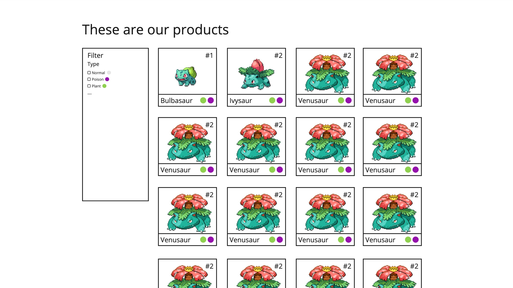

# Code Challenge

Important: Please read the whole document carefully and follow the guidelines within.

## Scenario

A new client approached us with the need for a product overview page. They also told us they already did a quick Mockup of how they imagine it. Our task in these situations is to ask all the important questions to finish the task, while still proofing our technical skills. Therefore you now have the task to build the component the client requested and later present it to the client (in the form of our next interview) to show what's possible with what they provided while asking all the important questions to finish the task.

### Here is all the information we got from the client:
1. The client sells small monsters fit for pocket size. They want to show all the monsters they have in a nice visual way.
2. The monsters should be filterable by their type (e.g. fire, water, earth, air).
3. The component should have an optional headline.
4. They believe that the monsters are the most important part of the component and should be the first thing the user sees.
5. Their internal IT department provides an API to get the monsters from. It is documented here: https://pokeapi.co/
6. All the information about the monsters should be taken from the API.
7. The monster detail pages will be implemented later, so there is no need to implement them now. But the monsters should be linkable.

### Here is the Mockup the client provided:

Good luck and have fun!
