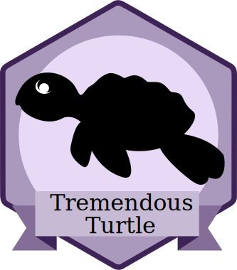

# Biotope: Basic Component
Level: *Tremendous Turtle*



You have learned a lot of basics in our daily developer life so far. You should feel comfortable with JS, CSS and HTML and have some experience with NPM, Node and Gulp. Now it is time for you to get to know Biotope!

> Goal: You understand how Biotope helps us to build scalable and reusable frontend frameworks and you are able to implement a simple component in a typical Biotope project.

---

## Preparation

You have already read about our Biotope vision. In this chapter you will start to get to know Biotope by building a simple webcomponent with Biotope Element. 

---

## Biotope Element

### Hints and Guidelines

- A component always consists of CSS and HTML (JS is optional)
- Each component lives in its own folder
- HTML is located in `template.js`
- JS is located in the `template.js` or `[your-component-name].js`
- Styles are located in `style.scss`
- Each CSS class starts with a unique component name
- The HTML of each component only uses its own prefixed classes
- Components can use other components, but they never overwrite their styles
- The seperate files of your component will be merged to one file by the biotope build system. So everything you import in the index.js, the imports of those imports, the imports of those imports... (see where I am going? ;)) will be merged and bundeled into one file.


### Resources

- Web components: https://developer.mozilla.org/en-US/docs/Web/Web_Components
- Introduction to web components: https://www.webcomponents.org/introduction
- Building applications with web components: https://www.youtube.com/watch?v=0FstJG9t5v0
- Building progressive web apps with web components: https://www.youtube.com/watch?v=we3lLo-UFtk
- Gulp: https://css-tricks.com/gulp-for-beginners/
- SCSS: https://css-tricks.com/using-sass-control-scope-bem-naming/
- Babel: https://www.pubnub.com/blog/2015-07-30-introduction-to-babel-javascript-compiler-for-es6/

### Challenge
#### 1. Explore Biotope Element
Install Biotope and Biotope Element in a local project using npm and start exploring. Your mentor can help you get going. Try to figure out how Biotope works. Have a look at our [Biotope Element documentation](https://element.biotope.sh/) and the [Biotope Repository](https://github.com/biotope/biotope).

#### 2. Add a simple component
Add a simple JavaScript component like a `title-component` or a `headline-component`.

#### 3. Add configuration to projectConfig.js
Biotope build is mainly used for bundling TypeScript components. As we want to use it for our JavaScript component we need to add the following configuration to our projectConfig.js:
```
copy: {
  ignoreList: [
		'components/**/*.js'
	]
}
```

#### 4. Templating with Handlebars
Try to use handlebars in a component. Add some JSON data and do some plug and play.

#### 5. Paths
Getting paths right: Think about where those paths lead and when you should use relative and when absolute paths.
```
./
../
/*
```

#### 5. Build an accordion
Add an accordion component. Get things working and then try to improve.

### Questions
<questions-component>
  <question-component>What is Biotope? (your own words)</question-component>
  <answer-component>Biotope is a toolchain for lasting Design Systems. It's a collection of tools to help you develop components for said system.</answer-component>
  <question-component>What is a webcomponent?</question-component>
  <answer-component>A webcomponent is an encapsulated peace of functionality/styles which represent a part of the DOM. It is a relatively new technology which is not supported by all browsers. But there a good polyfills.</answer-component>
  <question-component>What is a polyfill and how does it work under the hood?</question-component>
  <answer-component>A polyfill is a script which looks for functionality of the browser and add it, if it does not exist. So if for example <code>Array.prototype.find</code> is not defined, the polyfill will add this functionality which was written in JS by the author.</answer-component>
  <question-component>I would like to render an HBS template into the DOM, how would I do it?</question-component>
  <answer-component>You would have to include the handlebars runtime in the browser and then provide the loaded template with data to generate HTML. This HTML can then be appended to the DOM.</answer-component>
  <question-component>How can I check if a client supports a CSS property?</question-component>
  <answer-component><a href="http://www.caniuse.com" target=_blank>http://www.caniuse.com</a></answer-component>
  <question-component>What is a blocking script?</question-component>
  <answer-component>A blocking script is a script that is being loaded by a script tag in the DOM and blocks the loading of the rest of the resources, until it's done.</answer-component>
  <question-component>What is the recommended way of loading styles and JavaScript in Biotope?</question-component>
  <answer-component>Use the resource loader!</answer-component>
  <question-component>Why do we have a coding styleguide in Biotope?</question-component>
  <answer-component>A coding styleguide helps to keep all the code aligned clean and nicely. So it will be easy for a biotope developer to switch projects or even move code from one biotope project to another.</answer-component>
  <question-component>What is babel?</question-component>
  <answer-component>Babel is a JavaScript compiler, which takes your JS and transforms it depending on the configuration provided. It can help to transpile ES6/7/8 down to ES5. It can add new, unsupported browser functionality, by automatically add the required polyfills.</answer-component>
</questions-component>


<authors-component v-bind:authors="[
    {
      username: 'SheepFromHeaven',
      name: 'Marc Emmanuel'
    }]"/>

---------------------------------------

_**What helped you to master the challenges in this chapter? Please let us know and update this chapter.**_
