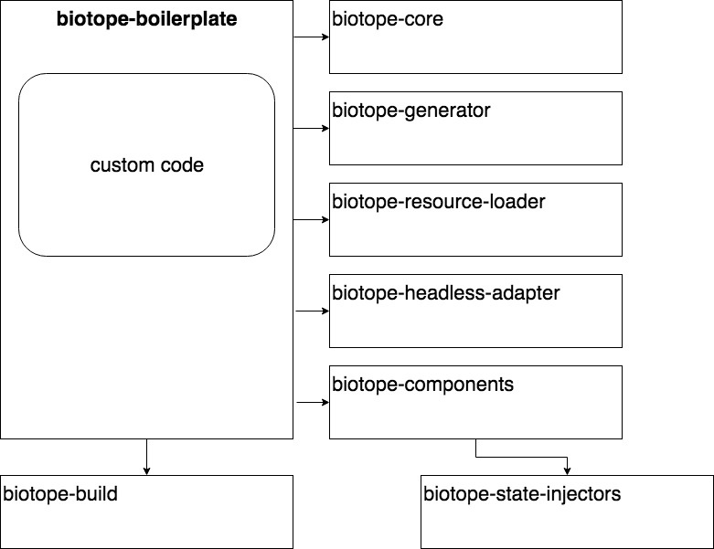

# Biotope Ecosystem
Level: *Wise Walrus*

You now have all the knowledge to build great projects with biotope. The final step will be to improve biotope ongoingly.
This chapter will help you to get a brief overview of the biotope architecture and all the repositories that play a role in there.

Plus it will help you to get started in the open source world and prepare you to contribute to the wide world of free code.

## Open Source Resources
https://help.github.com/articles/finding-open-source-projects-on-github/

https://help.github.com/articles/about-labels/

## Chart

## Biotope Meeting Notes
https://github.com/biotope/meeting-notes

## Questions
01. How to open source?
    - Which labels are Open Source standards?
    - What is a fork?
    - Why should you keep your Github profile clean and up to date?

02. What is the role of:
    - biotope-boilerplate
    - biotope-build
    - biotope-element
    - biotope-configuration
    - biotope-generator
    - biotope-resource-loader
    - biotope-cli
    - gists

**Pair programming**:
To practice the new open source knowledge we are going to solve a biotope issue together.
Pair programming helps to fokus and solve problems efficiently

<authors-component v-bind:authors="[
    {
      username: 'SheepFromHeaven',
      name: 'Marc Emmanuel'
    }]"/>
