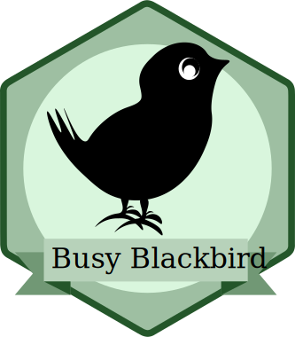
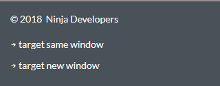
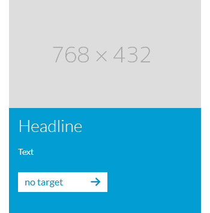
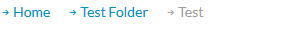
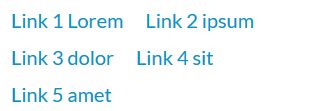
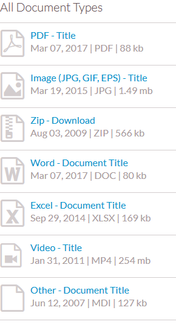

# Fundamentals I: HTML Semantics, Layout and Styling
Level: *Busy Blackbird*

You have already learned about our Manifesto, Biotope and have an overview of the first steps of this Roadmap.
In this Level you will learn how to write mobile first responsive web pages with HTML5 and CSS and how to create and use SVG Icons and Webfonts.

---------------------------------------
## Preparation
In this challenge you will learn how to create your own repository on GitHub, how to use Git and how you can use HTML5 Boilerplate for the following challenges.

### Resources
- Git Clients: https://git-scm.com/downloads
- Pro Git Book: https://git-scm.com/book/en/v2
- Git Command Line: https://git-scm.com/book/en/v2/Getting-Started-The-Command-Line
- HTML5 Boilerplate: https://html5boilerplate.com
- What is Git: https://git-scm.com/book/en/v2/Getting-Started-About-Version-Control
- What is Boilerplate: https://en.wikipedia.org/wiki/Boilerplate_code
- Git Flow: https://codeburst.io/trunk-based-development-vs-git-flow-a0212a6cae64

---
## GitHub

### Challenge
#### Create an account on GitHub
If you do not have an account at GitHub.com already, go to: https://github.com/join and create an account.
Please note that GitHub is a professional social network and choose an appropriate username.

And since you will soon be added to the <i>virtualidenityag</i> organization on GitHub, it's required that you enable two-factor authentication as a extra layer of protection. To do so, go to *settings > security*. There are three methods you can choose from (Authenticator app, Security keys and SMS). Just pick the one you're most comfortable with.

#### Create a repository on GitHub
Login to [GitHub](http://github.com/login) and create a [new repository](https://github.com/new).

Choose a *repository name* for this project. Take a name of your own choice, be creative! - or use this level's name "busy-blackbird-page" if you're lazy :-)

#### Clone GitHub repository locally
For this step you need to know more about the command line and how to use it. Open your computer's command line and clone the new repository from github with `git clone <your github URL>` to get a local copy.

#### Add a new file to the empty repository locally
After cloning your remote repository you need to add files to it. For this exercise we will create the README file for our project.

Go to your code editor, create a new file and write a nice description about your repository. Save your file with the name "README.md" and stage your changes using `git add README.md`.

#### Commit and Push your new file
At this point your file is created and staged, you need to add a message that explains what you did and commit those changes. For that you use `git commit -m " "`. Where "-m" means message and inside the quotes you should write something that describes what you did (example: you can use `git commit -m "Add README file"`).

Now that your file is commited you need to send it to the project's remote repository so everybody can see your changes. For that you need to use `git push` and that's it!
You have pushed your first file to your remote repository 😄

#### Create new Branch
Now we are going to create a new branch to fill our repository with nice code 😆

Go to your command line again and create a new branch using `git branch name-of-the-branch`
**_>_** The name of the branch must be meaningful!

Choose the name you want for your new branch. This will allow you to have a new branch without mixing the content of your master branch. You should *never* work directly in your master branch.
Then you need to use `git checkout name-of-the-branch` to change to your new branch.

> If you are lazy, you can use `git checkout -b name-of-the-branch` this will create a new branch and checkout at the same time 🤪

#### Get HTML5 Boilerplate
Now you're free to start playing with code, so download the HTML5 Boilerplate and extract it into your local repository.
Commit and push it into the repository.

#### Git clients
Some people prefer to use graphical tools to use git, so If you do not have installed a git client already, find and install a [git client for your local operating system](https://git-scm.com/downloads/guis).
There are a lot of options so feel free to use the one that you enjoy more! 

#### SSH
On a final note, it's important that you know about the SSH protocol. It allows you to connect and authenticate to remote servers and services. With SSH keys, you can connect to GitHub without using your username and password everytime. You can get all the information about how to create and setup your SSH keys at the [GitHub support page](https://help.github.com/en/github/authenticating-to-github/connecting-to-github-with-ssh).

### Questions
<questions-component>
  <question-component>What's Git?</question-component>
  <answer-component>Git is a versioning software which allows developers to manage different versions of their code. It is like a time machine, which allows you to go back in time, amd merge different timelines together.</answer-component>
  <question-component>What is a repository?</question-component>
  <answer-component>A repository is an instance of a git project, which is typically hosted on a git server somewhere in the web. In it, it keeps track of all versions of all files.</answer-component>
  <question-component>What is a branch?</question-component>
  <answer-component>A branch ist a copy of the whole project. By changing the files in one branch, you do not change the files in another branch of the same project.</answer-component>
  <question-component>What is a commit?</question-component>
  <answer-component>A commit is a marker in time, to mark the current state of your files. Its basically like a checkpoint, you can go back to anytime.</answer-component>
  <question-component>What is a remote?</question-component>
  <answer-component>A remote is a pointer to a repository in your git project. The default remote is named origin. You can add extra remotes by calling <code>git remote add [name] [url]</code></answer-component>
  <question-component>What does <code>git clone</code> do?</question-component>
  <answer-component>This command copies the repository to your computer. It automatically sets the remote 'origin' to your source repository</answer-component>
  <question-component>What does <code>git pull</code> do?</question-component>
  <answer-component>Git pull will get the newest version of the current branch from the repository.</answer-component>
  <question-component>What does <code>git add</code> do?</question-component>
  <answer-component>This command adds files to a commit BEFORE commiting. It basically tells git: These files are ready to commit.</answer-component>
  <question-component>What does <code>git status</code> do?</question-component>
  <answer-component>Git status will show the current status of your work. It will display changed files, and show if these files are already added or not.</answer-component>
  <question-component>What does <code>git push</code> do?</question-component>
  <answer-component>Git push will send all the commits on the current branch, which are not yet in the repository</answer-component>
  <question-component>What's the difference between Git and Github?</question-component>
  <answer-component>Git is the tool, Github is the platform. On github you can host repositories.</answer-component>
  <question-component>What's the Git Flow?</question-component>
  <answer-component>Git Flow is an example process, how one can use git. It serves blueprints on how to name branches and how to handle them.</answer-component>
</questions-component>
 

---------------------------------------

## Page Layout
In this challenge you will learn how to use HTML Semantic elements and how to develop mobile first responsive websites.

### Hints and Guidelines
1. Use semantic elements to structure your webpages.
2. Use CSS Grid to define the layout
3. Mobile first! Mobile first!
4. ... but can we just say, the desktop second?!

### Resources
- When to use which semantic HTML5 element: [HTML5 Element Flowchart](http://html5doctor.com/downloads/h5d-sectioning-flowchart.pdf)
- Why is CSS Grid a big deal and why should we care: [Getting Started with CSS Grid](https://css-tricks.com/getting-started-css-grid/)
- Download all screens for this level: [biotope-onboaring-fundamentals-1-screens.zip](/assets/fundamentals-1/biotope-onboaring-fundamentals-1-screens.zip ':ignore')

### Challenge

#### Bring your body in shape - from header to footer:
First create an html page based on the HTML5 Boilerplate and segment it with semantic elements.
Then add basic CSS styling for these areas (the yellow boxes) to match the layout shown in the screen graphics.

For the beginning you can set fixed heights to the elements so they match the screen graphics.
Other page content like headings, images, texts will be created later and are not yet part of this challenge.

#### Screens

---- you can't click on the images to zoom-in (applies for all images) ----

| Mobile 320px                                                                        | Desktop 1600px                                                                        |
|-------------------------------------------------------------------------------------|---------------------------------------------------------------------------------------|
|  |  |

| Header                                                    | Footer                                                    |
|-----------------------------------------------------------|-----------------------------------------------------------|
|  |  |

---- footer.png -> target same tab / target new tab instead of same window / new window ----

---------------------------------------

## Content Structure and Webfonts
In this challenge you will learn how to structure content in html documents and how to use headlines and semantic HTML5 elements.

### Hints and Guidelines
- Use HTML5 semantic sectioning elements to structure the content
- Correctly use HTML headlines h1 - h6
- Validate your HTML code!

### Resources
- HTML5 Standard on Sectioning Elements: [chapter 4.3 through 4.3.10](https://www.w3.org/TR/html5/sections.html#sections)
- Decision guide which HTML5 sectioning element to choose: [HTML5 Sectioning Flowchart](http://html5doctor.com/downloads/h5d-sectioning-flowchart.pdf)
- HTML5 suggests the so called [outline algorithm](https://www.w3.org/TR/html5/sections.html#outline) - but it's not implemented by any browser yet!
- Instead use the [basic rank of headlines](https://www.w3.org/TR/html5/sections.html#rank)
- MDN web docs on [Using HTML Sections and Outlines](https://developer.mozilla.org/en-US/docs/Web/Guide/HTML/Using_HTML_sections_and_outlines)
- Adrian Roselli: [There Is No Document Outline Algorithm](http://adrianroselli.com/2016/08/there-is-no-document-outline-algorithm.html)
- Dummy Text generator and origins and history of the "Lorem Ipsum" text: https://loremipsum.io/
- Dummy Image generator: https://dummyimage.com/.
- Use the [free webfont Lato](https://fonts.google.com/specimen/Lato) with font-weight 300, 400 and 700.
- W3C HTML5 Validator: https://validator.w3.org/

### Challenge
In this challenge you will learn how to structure content in html documents and how to use headlines and semantic HTML5 elements.

#### Basic page structure
Before adding the actual content to your html page, proceed with adding more semantic sectioning elements for further structuring of the content.

#### Headlines
Add HTML5 compliant headlines and sections to structure the content of your page.

#### Inner values matter!
Add dummy text and image content to your page, you can use dummy text and image generators for that.
With latter you can easily create dummy images like this:

---- Text should be above the img ----

#### Add some Teasers to turn them on!

Often, a combination of an image, short text and a link -  a teaser - is used to tease users to related content on other pages.
Multiple of such teasers can be combined in a teaser row.

#### Related Content
Place related content in a marginal column on the right, again choose a matching semantic element to markup this area of additional content.
You can use CSS to adjust position and size of this area.

#### Code is not valid until proven valid!
To ensure your HTML code is valid and can be correctly interpreted by browsers, search engines and screen readers, validate your code with the W3C HTML Validator.
Fix the reported validation errors in your HTML code.

#### Screens

| All 320px                                                                                                     | Stage                                                          | Breadcrumb                                                               |
|---------------------------------------------------------------------------------------------------------------|----------------------------------------------------------------|--------------------------------------------------------------------------|
|  |  |  |

| Section                                                                             | Form                                                                          | Contact Teaser                                                                 | Teasers                                                                             |
|-------------------------------------------------------------------------------------|-------------------------------------------------------------------------------|--------------------------------------------------------------------------------|-------------------------------------------------------------------------------------|
|  |  |  |  |

### Questions
<questions-component>
  <question-component>What are semantic elements in HTML5? Name at least 5</question-component>
  <answer-component>Each element in HTML has a special usecase you use it for. In HTML version 5 there were multiple semantic elements added which replace workarounds the web came up with. Some examples could be:
    - nav
    - header
    - footer
    - video
    - main
    - aside
  </answer-component>
  <question-component>When do you use which semantic element?</question-component>
  <answer-component>The used tag should whenever possible describe the semantic meaning of the websites element</answer-component>
  <question-component>Why is the correct hierarchy of headlines important?</question-component>
  <answer-component>The correct semantic hierarchy of headlines is for human readers and automated search engines important to easily determine the information structure.</answer-component>
  <question-component>Should you use multiple h1 headlines in one HTML document?</question-component>
  <answer-component>No! This will destroy the page structure and give you a penality to search rankings,</answer-component>
  <question-component>What are pseudo elements? What is their purpose?</question-component>
  <answer-component>A CSS pseudo-element is used to style specified parts of an element. For example, it can be used to: Style the first letter, or line, of an element. Insert content before, or after, the content of an element.</answer-component>
  <question-component>How do you include webfonts?</question-component>
  <answer-component>Local font files via @font-face or google font via Link-tag in html or @import in scss</answer-component>
  <question-component>Which webfont formats could be used? Why are there different formats?</question-component>
  <answer-component>TTF, OTF, WOFF, EOT. Different Browsers support different webfoot formats.</answer-component>
  <question-component>How can you provide different font weights and different font styles for a webfont?</question-component>
  <answer-component>Import correct font styles (every font weight you need on the page) with a @font-face, wehre you can then set the fonts weight. Change the displayed font styles with css in the rule with the font-weight attribute</answer-component>
  <question-component>How are CSS stylesheets embedded?</question-component>
  <answer-component>With a link tag in the html head</answer-component>
  <question-component>What is the purpose of normalize.css?</question-component>
  <answer-component>Consistently reset of default browser styles</answer-component>
  <question-component>What's the effect of specifity of CSS selectors?</question-component>
  <answer-component>Select specific DOM-elements with the matching css selector. Care: The more specific the selector, the harder to overwrite with an other style.</answer-component>
  <question-component>What has to be considered when declaring CSS selectors?</question-component>
  <answer-component>How specific needs the selector to be? Is the selector unnecessarily long or is the selector to general and you unintentionally overwrite other elements</answer-component>
  <question-component>What does <code>!important</code> do and why shouldn't you use it?</question-component>
  <answer-component><code>!important</code> is an anti-pattern to overwrite every other style and get the highest priority on the element. Maintaining a site with !important styles causes headache because it destroys the expected behavior and can’t be overwritten.</answer-component>
  <question-component>What are vendor-prefixes and which ones do exist?</question-component>
  <answer-component>Vendor-prefixes allow to use new features in different browsers: -webkit-, -ms-, - moz-, -o-</answer-component>
  <question-component>What are shorthand properties? Name at least 3?</question-component>
  <answer-component>Bring together different but relative css attributes into one. Often used attributes: padding, margin, box-shadow, background</answer-component>
  <question-component>When do you use img tags and when CSS background images?</question-component>
  <answer-component>Image tag will be part of the DOM and therefore part of the semantic of the page. Use background images if the image is not part of the actual content and if you need background specific styles as background-size cover or contain.</answer-component>
  <question-component>What are the different position properties and what's their effect on surrounding elements?</question-component>
  <answer-component>Static and relative positioned elements are included in the site context and affect the surrounding elements. Whereas absolute and fix positioned elements are taken out of the normal page flow and don’t affect the surrounding elements.</answer-component>
  <question-component>What is z-index and what's its effect?</question-component>
  <answer-component>The z-index property specifies the stack order of an element. An element with greater stack order is always in front of an element with a lower stack order.</answer-component>
  <question-component>How can you place two block elements side by side?</question-component>
  <answer-component>Use inline-block or layouting methods like flexbox or css grid.</answer-component>
  <question-component>What is CSS box-model?</question-component>
  <answer-component>CSS box model describes multiple properties including borders, margin, padding and the content itself, of each DOM-element.</answer-component>
  <question-component>What is CSS flex-box? When do you use it?</question-component>
  <answer-component>Flexbox is a layout mode in css3, that provides for a better arrangement of all of the page elements that behave in a predictable mode.</answer-component>
</questions-component>

 

---------------------------------------

## Navigation
In this Challenge you will learn how to build an accessible navigation and add the correct semantic elements and attributes.

### Hints and Guidelines
- Use HTML5 semantic elements to markup a navigation section
- Use a list structure for navigation links
- Add additional semantics for better accessibility

### Resources
- [WAI ARIA Overview](https://www.w3.org/WAI/standards-guidelines/aria/)
- [WAI ARIA W3C Recommendation](https://www.w3.org/TR/wai-aria/)
- MDN web docs: [ARIA basics](https://developer.mozilla.org/en-US/docs/Learn/Accessibility/WAI-ARIA_basics)
- [NVDA screen reader](https://www.nvaccess.org)
- [Apple iOS VoiceOver](https://help.apple.com/iphone/11/?lang=en#/iph3e2e415f)

### Challenge
#### Navigation Links
Add navigation links to the header like depicted in the screen. When clicking these links, they should lead to the subheadlines of the sections of the page.
Also consider using a semantic element for the navigation and a sensible structure of elements for the link list.

#### Additional Semantics and Accessibility
In addition to semantic elements, semantic meaning can be added to normal html elements with so called "ARIA-attributes". They were introduced by the Web Accessibility Initiative (WAI) with the additional recommendation called "WAI ARIA" to make HTML more semantic and accessible to screen readers and search engines. You are encouraged to read more about ARIA in the WAI ARIA Overview and the WAI ARIA W3C Recommendation.

If you have a Mac or an iOS device, activate VoiceOver, let it read out your navigation and page structure and try to navigate in the webpage with VoiceOver.
If you don't have an Apple Device or operating system, get NVDA and try the same with NVDA.

If you recognize that something on your page does not work or is not accessible with screen readers, try to improve it and make it accessible.

And if you want to really judge a frontend web developer: just take his or her iPhone and tripple-click the home button ;-)

### Screens

| Navigation Links                                    | Navigation Links, hover                                                |
|-----------------------------------------------------|------------------------------------------------------------------------|
|  |  |

### Questions
<questions-component>
  <question-component>Which semantic element should be used for page navigation?</question-component>
  <answer-component>Nav-tag for the navigation and a ul > li structure with ARIA labels for the menu and the menu items.</answer-component>
  <question-component>How can you add semantic meaning to any HTML elements?</question-component>
  <answer-component>If there is no native HTML tag for the semantic meaning of the element you can use the ARIA-role attribute.</answer-component>
  <question-component>Why should semantic attributes be added to html elements?</question-component>
  <answer-component>They add essential meaning to your content, which lets web browsers, search engines, screen readers, RSS readers, and ultimately users understand it.</answer-component>
</questions-component>

---------------------------------------

## Responsive Webdesign
In this challenge you will learn how to implement a responsive web page.

### Hints and Guidelines
- Implement fluid design if possible
- Use media queries for breakpoints if required

### Resources
- Short introduction to the viewport meta tag: https://developer.mozilla.org/en-US/docs/Mozilla/Mobile/Viewport_meta_tag
- Responsive design vs. adaptive design: https://css-tricks.com/the-difference-between-responsive-and-adaptive-design/
- Introduction to media queries: https://developer.mozilla.org/en-US/docs/Web/CSS/Media_Queries/Using_media_queries
- CSS Flex-Box: https://css-tricks.com/snippets/css/a-guide-to-flexbox/

### Challenge
#### Make your web page responsive
Note the screens provided below. Spot the differences in the different screen sizes of the page layout. Enhance your page so that it fits the screens. Use flex-box to implement a responsive grid.

- Note the image on the page, which is surrounded by text on the desktop version.
- Note the teaser, which can have two or three columns.

Set the viewport meta tag.

#### Screens

| 320px                                                                         | 480px                                                                         | 600px                                                                         |
|-------------------------------------------------------------------------------|-------------------------------------------------------------------------------|-------------------------------------------------------------------------------|
|  |  |  |

| 768px                                                                         | 1024px                                                                          | 1600px                                                                          |
|-------------------------------------------------------------------------------|---------------------------------------------------------------------------------|---------------------------------------------------------------------------------|
|  |  |  |

### Questions
<questions-component>
  <question-component>What is responsive design?</question-component>
  <answer-component>The goal of responsive design is to build websites that change the layout based on the actual device and viewport size.</answer-component>
  <question-component>What are media queries?</question-component>
  <answer-component>It uses the @media rule to include a block of CSS properties only if a certain condition like the min or max viewport width is true.</answer-component>
  <question-component>How can you realize a responsive image?</question-component>
  <answer-component>With the image srcset attribute or the picture HTML-tag</answer-component>
  <question-component>What do you use the viewport meta tag for?</question-component>
  <answer-component>The meta viewport element gives the browser instructions on how to control the page's dimensions and scaling.</answer-component>
</questions-component>

---------------------------------------

## SVG Sprites
In this task you will learn what SVG sprites are and how to use them.

### Hints and Guidelines
1. Use SVG sprites instead of icon fonts
2. Clean up the SVGs before using them. Remove unnecessary markup that was added by graphic programs.
3. Create the SVG sprite by hand or use a tool like Icomoon: https://icomoon.io/app/#/select/image

### Resources
- Check out https://css-tricks.com/svg-sprites-use-better-icon-fonts/ to see how SVG sprites work.
- With Icomoon (https://icomoon.io/app/#/select/image) you can create SVG sprites.
- You can find the necessary SVG files for the single icons on https://icomoon.io/#preview-free.

### Challenge
#### Document list
Create the document list component with SVG sprites. Based on the document typ another SVG Icon is displayed.

#### Screens

### Questions
<questions-component>
  <question-component>What is SVG and what are its advantages over pixelgraphics?</question-component>
  <answer-component>
    SVG is an image format, which is iamge and code in one. The single elements of the image are described by vectors. The advantage is that a vector image is scalable without loosing quality.
  </answer-component>
  <question-component>What are SVG sprites and how do you use them?</question-component>
  <answer-component>
    An SVG Sprite is a collection of SVG images all together in on SVG. After adding them/loading them into a page, you select the portion of the sheet to display in other places on the page.
  </answer-component>
  <question-component>What are the advantages of SVG sprites compared to icon fonts and pixel graphics?</question-component>
  <answer-component>
    In iconfonts, individual parts of the icon cannot be colored individually. In addition the developer often has to use pseudoelements instead of "real" dom.
    Pixel graphics are the most static icon formats. You cannot change anything about it but the size.
  </answer-component>
</questions-component>

<authors-component v-bind:authors="[
    {
      username: 'akrappe',
      name: 'Ann-Kristin Krappe'
    },
    {
      username: 'clemensf',
      name: 'Clemens Fiedler'
    },]"/>

---------------------------------------

_**Please take a moment to find something you can improve in this chapter.**_
