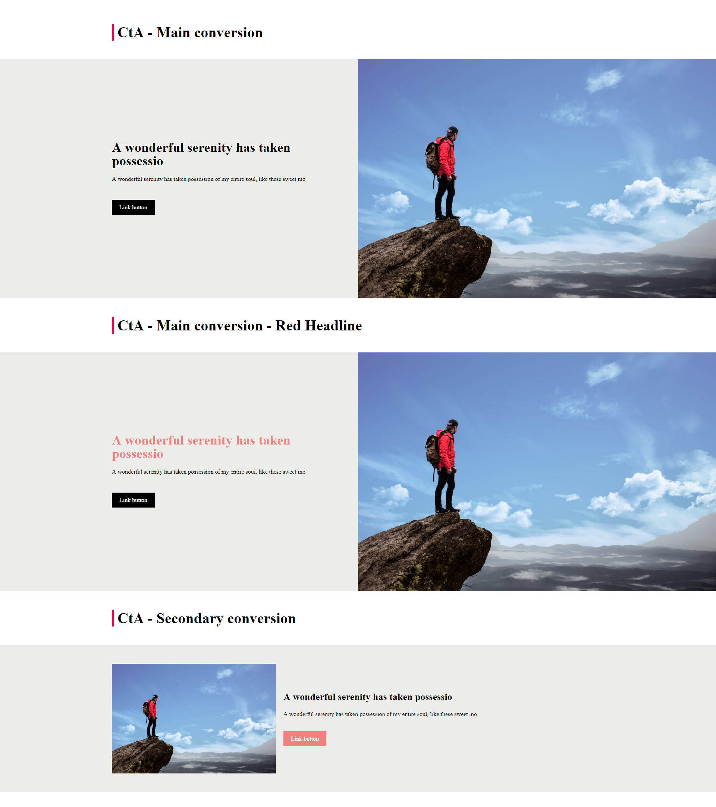

# Fundamentals II: Components

*Level: Competent Carp*

After you built a static page in the last chapter and learned about layout, content styling and semantics, you are now ready to take it a step further. In this chapter, you will learn about component-based architecture and how to build components using SASS, BEM and JavaScript. This should give you the necessary tools and knowledge to build state-of-the-art biotope components later on, and that is why you are here, right? Right. Let's get into it.

> Goal: You understand why we value components as building blocks of our frontends and you are able to implement interactive and animated components that can communicate with each other.

---

## Preparation

In this section, you will get to know a package manager (NPM) and a task runner (gulp) and how to use them in our project workflow. You will be using a micro frontend framework, that was specifically designed for this task.
We won't go into much detail about most of these topics, but if you want to read up on them, we put together a dandy list of links in the resources at the end of this section. 
*Note: the command lines in this abstract are all for Bash and perhaps need some adjustments for Shell / PowerShell.*

### Step 1: Install Node.js and NPM

Node.js is a way to run JavaScript code on your machine, without the need for a browser. It's mainly used to run servers and automatic tasks. You won't need to use it a lot, so it's not mandatory to do any work with it for this chapter.
Node.js comes with NPM, its very own package manager. This tool is used by the majority of web developers to install packages, libraries and other tools. It's pretty much your bread and butter and it is very much obligatory that you learn how to use it. The first step is to download and install it.
> For windows we recommend [nvm](https://github.com/creationix/nvm) for installing it.
If you are not on windows, just install it from [the Node.js homepage](https://nodejs.org/en/).
To ensure the installation worked correctly, type the following command into your command line:  `node -v && npm -v` (for PowerShell `(node -v) -and (npm -v)`)
If you don't get any errors, everything worked out as planned. Congrats!

### Step 2: Fork the framework

Now that you have all the tools you need, it's time to get your hands dirty and start working on the framework. You already know how to use Git to your advantage, so go ahead and fork and then clone [this GitHub repository](https://github.com/virtualidentityag/dev-fe-onboarding-miniframework).

### Step 3: Install gulp

Gulp is a task runner, which does a lot of work for you like compile, build, serve and other stuff. To install it, run the command `npm install gulp-cli -g` and then `npm install gulp -D`. This command will automatically add the dependency gulp to the `devDependencies` section in your `package.json`.
?> *That's how easy it is to install packages with NPM, how neat!*

### Step 4: Install the packages

A project realistically (unless you want to reinvent the wheel) requires packages. Packages are just code from other developers that you can use in your project. Open Source for the win! When you just clone a project from Git, that does not include the packages themselves, because that would just take up unnecessary space on GitHub's servers. What you do get, is a file called `package.json`, which includes a list of all the packages the project requires. What we do now, is download those packages. To do this, run the command `npm install` either in your OS's own command line or from within your IDE (ask your buddy to help you with this if necessary).

### Step 5: Start the framework

Now that all the necessary packages are installed, you can run the command `npm start`. This script command, which is defined in the `package.json` file, runs a gulp task that serves the website locally, so you can always see what you're coding. Now that the framework is served, you can start coding components. Good luck! (Keep on reading before complaining!)

!> Our coders tried really hard to provide you with the best framework so that you can start coding immediately. However, they are humans, so if you find any bugs, try to fix them yourself. If you get stuck, just ask your buddy for help. Have fun!

### Resources

+ [Node.js Guide for Frontend Developers](https://blog.bloomca.me/2018/06/21/nodejs-guide-for-frontend-developers.html)
+ [Introduction to gulp](https://developers.google.com/web/ilt/pwa/introduction-to-gulp)

### Questions

<questions-component>
  <question-component>What is a package manager like npm and what are the benefits of using one?</question-component>
  <answer-component>A package manager does exactly what his name implies: It manages packages which are libraries of code hosted in a package registry. It helps you to keep track of the different versions of the codebase and is the tool for installing packages in your project.</answer-component>
  <question-component>What is the purpose of the `package.json` file?</question-component>
  <answer-component>The <code>package.json</code> file contains all the information about the project. A name, a version, a description and most importantly: All the dependencies of the project, as well as their versions.</answer-component>
  <question-component>What is the purpose of the <code>package-lock.json</code> file?</question-component>
  <answer-component>While the <code>package.json</code> only lists the versions of the direct dependencies, the <code>package-lock.json</code> lists all the versions of the whole dependency tree. So every developer installing the project get exactly the same package tree.</answer-component>
  <question-component>What is the <code>node_modules</code> folder?</question-component>
  <answer-component>The <code>node_modules</code> folder contains all the packages installed in the project, as well as their dependencies. It gets generated on a <code>npm install</code></answer-component>
  <question-component>What happens when you execute <code>npm install</code> or <code>npm i</code>? Why is it necessary to execute this command?</question-component>
  <answer-component>This command will install/download all the dependencies listed in the <code>package.json</code> (<code>package-lock.json</code> if present) into the <code>node_modules</code> folder.</answer-component>
  <question-component>How do you add a new package to a npm project?</question-component>
  <answer-component><code>npm i [package-name]@[package-version]</code></answer-component>
  <question-component>How do you update a package in a npm project?</question-component>
  <answer-component>There are two update cases. If you want to update to the newest version that satisfies the version tag in the <code>package.json</code> just run <code>npm update</code>. If you want to install an entirely new version use <code>npm i [package-name]@[package-version]</code> instead. Avoid changing the version in the <code>package.json</code> manually, as it will break all the auto lock mechanisms of npm.</answer-component>
  <question-component>What is a task runner and what are the benefits of using one?</question-component>
  <answer-component>A task runner does as it says: It will run tasks for you. An example would be Gulp. You define what the tasks should do and when they will run, and the task runner will run them for you. This will take a lot of repeatable tasks from your hand and take care of them for you.</answer-component>
  <question-component>What are good tasks to automate? Think of typical processes that need to be executed for a project to run.</question-component>
  <answer-component>
  <ul>
    <li>Compilation</li>
    <li>Minify/Uglify</li>
    <li>Transpilation</li>
    <li>Copying/Moving of files</li>
    <li>Watching for changes</li>
  </ul>
  </answer-component>
</questions-component>

---

## SCSS

Now that everything is set up, you are ready to code once again! In the previous chapter, you built a static website with HTML and CSS, mainly focusing on structure and layout. In this chapter, you will learn to use SCSS in combination with BEM to give your stylesheets an underlying naming system, which will give your code even more structure and prepare you to build components in biotope later on.

### Hints and Guidelines

- Adhere to the BEM naming structure closely as it is absolutely vital to learn it in order to write good biotope components later on
- Use the BEM way to make modifiers for the component (see reference)

### Resources
- [SASS's own reference](https://sass-lang.com/guide) or [CSS-Tricks](https://css-tricks.com/snippets/sass/)
- [BEM's own reference](http://getbem.com/naming/) or [CSS-Tricks](https://css-tricks.com/bem-101/)

### Challenge

Build a so called 'call to action', consisting of an image, text and button. The component has 2 modifiers: red headline and secondary conversion, which has a completely different layout and look (see the screen below for reference).

### Questions
<questions-component>
  <question-component>What is BEM and what are its benefits?</question-component>
  <answer-component>BEM stands for Block, Element, Modifier. This methodology separates styles in Blocks, which are standalone entities, Elements, which are just a part of a block and modifiers, which are used to flag Blocks or Elements. This clear structure helps to build clearly understandable CSS/Sass code.</answer-component>
  <question-component>What are the benefits of sass compared to plain CSS?</question-component>
  <answer-component>
  In sass you, can declare variables, mixins, functions and baseclasses which you then can use all over your styles. The helps to avoid repetition and keeps your codebase clean (DRY principle)</answer-component>
  <question-component>Unmodified sass code can be used in web browsers. True or false?</question-component>
  <answer-component>False! Sass always needs to be compiled to css to be run in the browser.</answer-component>
  <question-component>What is a mixin in sass?</question-component>
  <answer-component>A mixin is a reusable block of sass that inserts rules into the place where you use it.</answer-component>
  <question-component>What is a function in sass?</question-component>
  <answer-component>A function returns a value which you can use as a value for a property.</answer-component>
</questions-component>

---

## JavaScript

'Finally', is what you are thinking to yourself probably. Yes, now we're getting into the good stuff. Up until now, everything you have coded is more or less 'static'. Well, that changes now. in this section you will get to know Javascript and get familiar with one of the latest versions called ECMAScript2015 (also known as ES6).
Let's not forget to mention that we (and the web in general) come from a period where jQuery was the standard. However from today's point of view, everything JQuery can do, VanillaJS or TypeScript (see Chapter 'Advanced Components') can do better and faster. We here at VI want to leave the jQuery era behind and try to write our code in ES6 (or even newer ES versions) whenever possible.

### Hints and Guidelines

- Try to apply ES6 code when possible (it's the future!)
- To debug, use the tools that you are provided with (*hint* Chrome dev tools *hint*)
- There is more than one way to skin a cat.. uhhh animate. CSS and JavaScript can do this, ask your buddy for help!

### Resources

- [JavaScript Basics](https://medium.freecodecamp.org/learn-these-javascript-fundamentals-and-become-a-better-developer-2a031a0dc9cf)
- [Getting started with ES6](http://2ality.com/2015/08/getting-started-es6.html)
- [CSS Animations](https://developer.mozilla.org/en-US/docs/Web/CSS/CSS_Animations/Using_CSS_animations)
- [CSS Transitions](https://developer.mozilla.org/en-US/docs/Web/CSS/transition)

### Challenge

Add the following functionality to the component, that you built in the section 'SCSS': When the button is clicked, a textbox underneath the already existing elements slides open.

### Questions

<questions-component>
  <question-component>Why should you use plain JS and avoid jQuery?</question-component>
  <answer-component>As a lot of the functionality of jQuery is already in vanilla JS, jQuery doesn't add any benefits anymore but still adds a lot of filesize.</answer-component>
  <question-component>What is ECMAScript? How is it different from vanilla JS?</question-component>
  <answer-component>Trick question! ECMAScript basically is JavaScript and the version of JS is represented by the ECMAScript abbrevation: ES (i.e. ES6)</answer-component>
  <question-component>ES6 can be used in every browser. True or false?</question-component>
  <answer-component>Tralse/Frue. Not without transpilation (i.e. with babel)</answer-component>
  <question-component>What are common ways to debug code in the web development environment?</question-component>
  <answer-component>You either can use the debugger of your preferred browser, or add console.log, preferably debugger statements to your code.</answer-component>
  <question-component>What's the best way to make great animations?</question-component>
  <answer-component>With CSS you can create a lot of simple animations, which really run very fluid. But you are limited to simple movement/transformations. For more complex animations you would have to fall back to SVG/JS animations.</answer-component>
</questions-component>

---

## Events

Components need to communicate with each other. For example, you would probably want an open tooltip to close when the user opens the navigation on your page. In order for this to work, the navigation needs to tell the tooltip to disappear.

*Navigation to tooltip, probably*

One possibility to do this is using events. The usual approach to this is to fire an event when the navigation component is being opened and then having the tooltip component listen to any events that might cause it to close.

### Hints and Guidelines

- Optional challenge: Perhaps you are familiar with a more modern approach to component communication: State management. If you want to, you can complete the challenge using Redux or something similar as well

### Resources

- [JS Events reference](https://developer.mozilla.org/en-US/docs/Web/Events)
- [More specifically, the JS `addEventListener()` function](https://developer.mozilla.org/en-US/docs/Web/API/EventTarget/addEventListener)

### Challenge

Copy the component you built in the previous step. When one of the buttons is clicked and the corresponding textbox is opened, the other textbox has to close. The rule is: Only one call-to-action textbox can be opened at all times.

### Questions

- What are events and how do they work? What purpose do they serve?
- What is event delegation and how does it work?

<authors-component v-bind:authors="[
    {
      username: 'dweiger',
      name: 'Dominikus Weiger'
    },
    {
      username: 'luke-m',
      name: 'Lukas Müller'
    }]"/>

---------------------------------------

_**You found something missing? Why not add it to this chapter?**_
