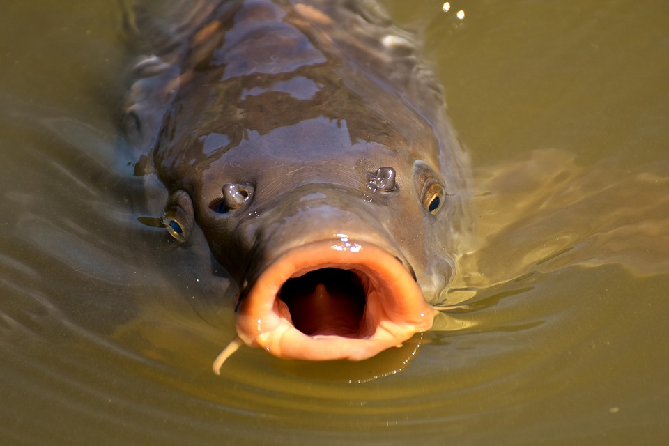

# Fundamentals II: Components

*Level: Competent Carp*

After you built a static page in the last chapter and learned about layout, content styling and semantics, you are now ready to take it a step further. In this chapter, you will learn about component based architecture and how to build components using SASS, BEM and Javascript. This should give you the necessary tools and knowledge to build state-of-the-art biotope components later on, and that's why you're here, right? Right. Let's get into it.

---

## Preparation

In this section, you will get to know package managers (NPM / Yarn) and a taskrunner (gulp) and how to use them in our project workflow. You will be using a micro frontend framework, that was specifically designed for this task.
We won't go into much detail about most of these topics, but if you want to read up on them, we put together a dandy list of links in the resources at the end of this section.

### Step 1: Install Node.js and NPM

Node.js is a way to run Javascript code without the need to use a browser. It's mainly used to run servers. You won't need to use it a lot, so it's not mandatory to do any work with it for this chapter.
Node.js comes with NPM, its very own package manager. This tool is used by the majority of web developers to install packages, libraries and other tools. It's pretty much your bread and butter and it is very much obligatory that you learn how to use it. The first step is to download and install it from [the Node.js homepage](https://nodejs.org/en/).
To ensure the installation worked correctly, type the following command into your command line:  `node -v && npm -v`
If you don't get any errors, everything worked out as planned. Congrats!

### Step 2: Install Yarn

We here at VI use a different package manager called Yarn. It completes the same tasks as NPM, that's all you need to know for now. Go ahead and get it from [the Yarn homepage](https://yarnpkg.com/lang/en/docs/install/#windows-stable).
Try `yarn -v` to check if the installation worked.

### Step 3: Install Gulp

Gulp is a taskrunner, which does a lot of work for you like compile, build, serve and other stuff. To install it, run the command `npm install gulp-cli -g` and then `npm install gulp -D`.
?> *That's how easy it is to install packages with NPM, how neat!*

Gulp works with a so called `gulpfile.js`, which defines which tasks gulp completes for you. `gulpfiles` are written in JS. For this task, we will provide you with one.

### Step 3: Fork the framework

Now that you have all the tools you need, it's time to get your hands dirty and start working on the framework. You already know how to use Git to your advantage, so go ahead and fork and then clone [the GitHub repository](https://github.com/virtualidentityag/dev-fe-onboarding-miniframework).

### Step 4: Install the packages

A project realistically (unless you want to reinvent the wheel) requires packages. Packages are just code from other developers that you can use in your project. Open Source for the win! When you just clone a project from Git, that does not include the packages themselves, because that would just take up unnecessary space on Github's servers. What you do get, is a file called `package.json`, which includes a list of all the packages the project requires. What we do now, is download those packages. To do this, run the command `yarn install` either in your OS's own command line or from within your IDE (ask your buddy to help you with this if necessary).

### Step 5: Start the framework

Now that all the necessary packages are installed, you can run the command `yarn start`. This script command, which is defined in the `package.json` file, runs a gulp task that serves the website locally, so you can always see what you're coding. Now that the framework is served, you can start coding components. Good luck!

Our coders tried really hard to provide you with the best framwork so that you can start coding immediately. However they are humans, so if you find any bugs, try to fix them yourself. If you get stuck, just ask your buddy for help. Have fun!

### Resources

+ [Node.js Guide for Frontend Developers](https://blog.bloomca.me/2018/06/21/nodejs-guide-for-frontend-developers.html)
+ [Introduction to gulp](https://developers.google.com/web/ilt/pwa/introduction-to-gulp)

### Questions

+ What is a package manager and what are the benefits of using one?
+ What is the purpose of the `package.json` file?
+ What is the `node_modules` folder?
+ What happens when you execute `npm install` or `yarn install`? (hint: they both serve the same purpose) Why is it necessary to execute these commands?
+ How do you add a new package to a project?
+ What is a taskrunner and what are the benefits of using one?
+ What are good tasks to automate? Think of typical processes that need to be executed for a project to run.

---

## SCSS

Now that everything is set up, you are ready to code once again! In the previous chapter, you built a static website with HTML and CSS, mainly focussing on structure and layout. In this chapter, you will learn to use SCSS in combination with BEM to give your stylesheets an underlying naming system, which will give your code even more structure and prepare you to build components in biotope later on.

### Challenge

Build a so called 'call to action', consisting of a image, text and button. The component has 2 modifiers: red headline and secondary conversion, which has a completely different layout and look (see the screen below for reference).

### Hints and Guidelines

- Adhere to the BEM naming structure closely as it is absolutely vital to learn it in order to write good biotope components later on
- Use the BEM way to make modifiers for the component (see reference)

### Resources
- [SASS's own reference](https://sass-lang.com/guide) or [CSS-Tricks](https://css-tricks.com/snippets/sass/)
- [BEM's own reference](http://getbem.com/naming/) or [CSS-Tricks](https://css-tricks.com/bem-101/)

### Questions

- What is BEM and what are its benefits?
- What is a typical use case for a modifier?
- What are the benefits of SASS compared to plan CSS?
- Can you use unmodified SASS code in web browsers?
- What is a mixin?

---

## JavaScript

'Finally', is what you're thinking to yourself probably. Yes, now we're getting into the good stuff. Up until now, everything you have coded is more or less 'static'. Well, that changes now. In this section, you will get to Javascript, it's newest version ECMAScript2015 (also called ES6) and, to a lesser extent, jQuery. We here at VI try to write our code in ES6 whenever possible. jQuery, while it used to be the standard and provides a lot of functionality that makes our lives easier, is being used less and less and it's more than likely that it will completely die eventually. That is why coding in 'plain' JS is always preferred.

### Challenge

Add the following functionality to the component, that you built in the section 'SCSS': When the button is clicked, a textbox underneath the already existing elements slides open.

### Hints and Guidelines

- Try to apply ES6 code when possible (it's the future!), but also try out jQuery here and there
- To debug, use the tools that you are provided with (*hint* Chrome dev tools *hint*)
- There's more than one way to skin a cat.. uhhh animate. CSS, jQuery and Javascript can all do this, ask your buddy for help!

### Resources

- [Javascript Basics](https://medium.freecodecamp.org/learn-these-javascript-fundamentals-and-become-a-better-developer-2a031a0dc9cf)
- [Getting started with ES6](http://2ality.com/2015/08/getting-started-es6.html)
- [jQuery Fundamentals](http://jqfundamentals.com/chapter/jquery-basics)
- [CSS Animations](https://developer.mozilla.org/en-US/docs/Web/CSS/CSS_Animations/Using_CSS_animations)
- [CSS Transitions](https://developer.mozilla.org/en-US/docs/Web/CSS/transition)

### Questions

- What is jQuery and what are its benefits?
- Why should you try to use plain JS when possible?
- What is ES6? How is different from 'plain' JS?
- ES6 can be used in every browser. True of false?
- What are common ways to debug code in the web development environment?
- What's the best way to make great animations?

---

## Events

Components need to communicate with each other. For example, you would probably want an open tooltip to close when the user opens the navigation on your page. In order for this to work, the navigation needs to tell the tooltip to disappear.

*Navigation to tooltip, probably*

One possiblity to do this is using events. The usual approach to this is to fire an event when the navigation component is being opened and then having the tooltip component listen to any events that might cause it to close.

### Challenge

Copy the component you built in the previous step. When one of the buttons is clicked and the corresponding textbox is opened, the other textbox has to close. The rule is: Only one call-to-action textbox can be opened at all times.

### Hints and Guidelines

- As stated before, JS/ES6 is preffered. However, jQuery provides a different way of implementing events. Try completing the challenge twice, once in plain JS and once in jQuery to see the difference
- Optional challenge: Perhaps you are familiar with a more modern approach to component communication: State management. If you want to, you can complete the challenge using Redux or something similiar as well

### Resources

- [jQuery Events reference](https://api.jquery.com/category/events/)
- [More specifically, the jQuery `on()` function](https://api.jquery.com/on/)

### Questions

- What are events and how do they work? What purpose do they serve?
- What is event delegation and how does it work in JS vs jQuery?

<authors-component v-bind:authors="[
    {
      username: 'dweiger',
      name: 'Dominikus Weiger'
    },
    {
      username: 'luke-m',
      name: 'Lukas Müller'
    }]"/>
