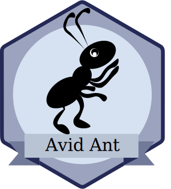

# Getting Started

Level: <i>Avid Ant</i>

Hello there and welcome to VI!

> Goal: You will have a basic understanding of our Manifesto and Biotope. You can start right away and know where you are heading without being over- or underchallenged.

---

## Preparation

In your first chapter you will learn about our Developer Manifesto, the history and vision of Biotope and you will setup the first steps of your roadmap with your mentor!

### Resources

http://manifest-dev.virtual-identity.com/  
https://github.com/biotope/meeting-notes/blob/biotopeVision/biotope/2018-06-05_biotopeVision.md

---

## Our Vision

New developers are enthusiastic to work with Biotope right away -
we share our experience so they can quickly make progress
and become an active part of the community.
We give them an easy start with a sense of achievement,
so that they are able to easily carry out projects with Biotope
and to participate in improving Biotope itself.

Please keep in mind: This vision and all resulting actions should be kept aligned to the overall Biotope Vision
We imagine three pillars:

- Enabling
- Sharing
- Mentoring

Some examples to illustrate what we could actually implement:

<table cellPadding="5" style="tableLayout: 'fixed'; border: 1 + 'px'; borderColor: 'black'; borderStyle: 'solid'; borderCollapse: 'collapse';">
  <colgroup>
    <col style="width: 33.8624 + '%'"/>
    <col style="width: 38.9771 + '%'"/>
    <col style="width: 27.1605 + '%'"/>
  </colgroup>
  <tbody>
    <tr style="backgroundColor: '#F0F0F0'">
      <th style="tableLayout: 'fixed'; border: 1 + 'px'; borderColor: '#333'; borderStyle: 'solid'; borderCollapse: 'collapse'; textAlign: 'left'">Enabling</th>
      <th style="tableLayout: 'fixed'; border: 1 + 'px'; borderColor: '#333'; borderStyle: 'solid'; borderCollapse: 'collapse'; textAlign: 'left'">Sharing</th>
      <th style="tableLayout: 'fixed'; border: 1 + 'px'; borderColor: '#333'; borderStyle: 'solid'; borderCollapse: 'collapse'; textAlign: 'left'">Mentoring</th>
    </tr>
    <tr>
      <td style="border: 1 + 'px'; borderColor: 'black'; borderStyle: 'solid'">Getting Started Guide</td>
      <td style="border: 1 + 'px'; borderColor: 'black'; borderStyle: 'solid'">Frontend Practice, Meetup</td>
      <td style="border: 1 + 'px'; borderColor: 'black'; borderStyle: 'solid'">Initial task</td>
    </tr>
    <tr>
      <td style="border: 1 + 'px'; borderColor: 'black'; borderStyle: 'solid'" >
        

          Tutorials
        

      </td>
      <td style="border: 1 + 'px'; borderColor: 'black'; borderStyle: 'solid'" >Buddy</td>
      <td style="border: 1 + 'px'; borderColor: 'black'; borderStyle: 'solid'" >Mentoring, Coaching</td>
    </tr>
    <tr>
      <td style="border: 1 + 'px'; borderColor: 'black'; borderStyle: 'solid'" >Cookbook, Pattern</td>
      <td style="border: 1 + 'px'; borderColor: 'black'; borderStyle: 'solid'" >Internship Dev FR (from Porto)</td>
      <td style="border: 1 + 'px'; borderColor: 'black'; borderStyle: 'solid'" >Training, Workshop</td>
    </tr>
    <tr>
      <td style="border: 1 + 'px'; borderColor: 'black'; borderStyle: 'solid'"  colSpan="1">Big Picture, Vision, Why</td>
      <td style="border: 1 + 'px'; borderColor: 'black'; borderStyle: 'solid'"  colSpan="1">
        Chats
      </td>
      <td style="border: 1 + 'px'; borderColor: 'black'; borderStyle: 'solid'"  colSpan="1">Initialization, Ritual</td>
    </tr>
    <tr>
      <td style="border: 1 + 'px'; borderColor: 'black'; borderStyle: 'solid'"  colSpan="1">...</td>
      <td style="border: 1 + 'px'; borderColor: 'black'; borderStyle: 'solid'"  colSpan="1">Stackoverflow</td>
      <td style="border: 1 + 'px'; borderColor: 'black'; borderStyle: 'solid'"  colSpan="1">...</td>
    </tr>
  </tbody>
</table>

---

## Roadmap

__Every new frontend developer is able to implement components in our Biotope projects, in compliance with our VI standards__

Which includes
- knowing our common standards and
- having mastered the technical basics

This roadmap and all tasks should be kept aligned to the overall Biotope Vision and updated accordingly.

Please keep in mind. This roadmap will allways be work in progress. We want this to be a living document.
Duration

more or less 13 weeks (= 3 months)

<table cellPadding="5" style="tableLayout: 'fixed'; border: 1 + 'px'; borderColor: 'black'; borderStyle: 'solid'; borderCollapse: 'collapse'">
  <tbody>
    <tr>
      <th style="backgroundColor: '#F0F0F0'; tableLayout: 'fixed'; border: 1 + 'px'; borderColor: '#333'; borderStyle: 'solid'; borderCollapse: 'collapse'; textAlign: 'left'">Preparation</th>
      <th style="backgroundColor: '#F0F0F0'; tableLayout: 'fixed'; border: 1 + 'px'; borderColor: '#333'; borderStyle: 'solid'; borderCollapse: 'collapse'; textAlign: 'left'">
         
      </th>
      <th style="backgroundColor: '#F0F0F0'; tableLayout: 'fixed'; border: 1 + 'px'; borderColor: '#333'; borderStyle: 'solid'; borderCollapse: 'collapse'; textAlign: 'left'"  colSpan="1">Ongoing</th>
    </tr>
    <tr>
      <td style="border: 1 + 'px'; borderColor: 'black'; borderStyle: 'solid'"  colSpan="1">
         
      </td>
      <td style="border: 1 + 'px'; borderColor: 'black'; borderStyle: 'solid'"  colSpan="1">
        <ul>
          <li>assign a mentor and buddies for each lesson</li>
          <li>roadmap checklist for mentor</li>
        </ul>
      </td>
      <td style="border: 1 + 'px'; borderColor: 'black'; borderStyle: 'solid'"  colSpan="1">
         
      </td>
    </tr>
    <tr>
      <td style="border: 1 + 'px'; borderColor: 'black'; borderStyle: 'solid'">
        <ul>
          <li>Organize accounts</li>
          <li>Adjust roadmap to individual skills</li>
        </ul>
        

          <em>Goal: you can start right away and know where you are heading without being over- or underchallenged</em>
        

      </td>
      <td style="border: 1 + 'px'; borderColor: 'black'; borderStyle: 'solid'">
        <ul>
          <li>
            <strong>Manifesto Introduction</strong>
          </li>
        </ul>
      </td>
      <td style="border: 1 + 'px'; borderColor: 'black'; borderStyle: 'solid'"  colSpan="1">
         
      </td>
    </tr>
    <tr>
      <th style="backgroundColor: '#F0F0F0'; tableLayout: 'fixed'; border: 1 + 'px'; borderColor: '#333'; borderStyle: 'solid'; borderCollapse: 'collapse'; textAlign: 'left'">Fundamentals</th>
      <th style="backgroundColor: '#F0F0F0'; tableLayout: 'fixed'; border: 1 + 'px'; borderColor: '#333'; borderStyle: 'solid'; borderCollapse: 'collapse'; textAlign: 'left'">Use Github for this level</th>
      <th style="backgroundColor: '#F0F0F0'; tableLayout: 'fixed'; border: 1 + 'px'; borderColor: '#333'; borderStyle: 'solid'; borderCollapse: 'collapse'; textAlign: 'left'"  colSpan="1">
         
      </th>
    </tr>
    <tr>
      <td style="border: 1 + 'px'; borderColor: 'black'; borderStyle: 'solid'"  colSpan="1">
         
      </td>
      <td style="border: 1 + 'px'; borderColor: 'black'; borderStyle: 'solid'"  colSpan="1">
        <ul>
          <li>JIRA Introduction</li>
          <li>Git Introduction</li>
        </ul>
      </td>
      <td style="border: 1 + 'px'; borderColor: 'black'; borderStyle: 'solid'"  rowspan="10">
        <ul>
          <li>Values of the Manifesto</li>
          <li>Best Practices</li>
          <li>Browser Support</li>
          <li>Clean Code</li>
          <li>QA</li>
          <li>JIRA Workflow</li>
          <li>Agile</li>
        </ul>
      </td>
    </tr>
    <tr>
      <td style="border: 1 + 'px'; borderColor: 'black'; borderStyle: 'solid'">
        

          Layout, Content Styling and Semantics
        

        

          <em>Goal: you know how to create a modern static web page</em>
        

      </td>
      <td style="border: 1 + 'px'; borderColor: 'black'; borderStyle: 'solid'">
        <ul>
          <li>
           HTML + CSS</li>
          <li>Webfonts, SVG Icons</li>
          <li>Responsive Design, Mobile First</li>
        </ul>
      </td>
    </tr>
    <tr>
      <td style="border: 1 + 'px'; borderColor: 'black'; borderStyle: 'solid'"  colSpan="1">
         
      </td>
      <td style="border: 1 + 'px'; borderColor: 'black'; borderStyle: 'solid'"  colSpan="1">
        <ul>
          <li>Component based architecture</li>
          <li>node.js</li>
          <li>npm + yarn</li>
          <li> gulp</li>
        </ul>
      </td>
    </tr>
    <tr>
      <td style="border: 1 + 'px'; borderColor: 'black'; borderStyle: 'solid'">
        

          Components
        

        

          <em>Goal: you understand why we value components as building blocks of our frontends and you are able to implement interactive and animated components that can communicate with each other</em>
        

      </td>
      <td style="border: 1 + 'px'; borderColor: 'black'; borderStyle: 'solid'">
        <ul>
          <li>
            JS + ES
          </li>
          <li>jQuery &amp; Web Component</li>
          <li>
            BEM + SASS
          </li>
          <li>DOM</li>
          <li>Interaction</li>
          <li>Animation</li>
          <li>Component communication</li>
          <li>Debugging</li>
        </ul>
      </td>
    </tr>
    <tr>
      <th style="backgroundColor: '#F0F0F0'; tableLayout: 'fixed'; border: 1 + 'px'; borderColor: '#333'; borderStyle: 'solid'; borderCollapse: 'collapse'; textAlign: 'left'">Biotope</th>
      <th style="backgroundColor: '#F0F0F0'; tableLayout: 'fixed'; border: 1 + 'px'; borderColor: '#333'; borderStyle: 'solid'; borderCollapse: 'collapse'; textAlign: 'left'">Use Bitbucket for this level</th>
    </tr>
    <tr>
      <td style="border: 1 + 'px'; borderColor: 'black'; borderStyle: 'solid'"  colSpan="1">
         
      </td>
      <td style="border: 1 + 'px'; borderColor: 'black'; borderStyle: 'solid'"  colSpan="1">
        <ul>
          <li>Getting Started Jam:<ul>
              <li>Biotope Vision</li>
              <li>Biotope Setup</li>
              <li>Biotope Boilerplate</li>
            </ul>
          </li>
          <li>Advanced Git (Merge, Rebase, PR, Fast Forward, Cherry Picking)</li>
          <li>State</li>
        </ul>
      </td>
    </tr>
    <tr>
      <td style="border: 1 + 'px'; borderColor: 'black'; borderStyle: 'solid'">
        
Biotope Basic Components

        

          <em>Goal: you understand how Biotope helps us to build scalable and reusable frontend frameworks and you are able to implement a simple component in a typical Biotope project</em>
        

      </td>
      <td style="border: 1 + 'px'; borderColor: 'black'; borderStyle: 'solid'">
        <ul>
          <li>Biotope Component</li>
          <li>Handlebars + JSON</li>
        </ul>
      </td>
    </tr>
    <tr>
      <td style="border: 1 + 'px'; borderColor: 'black'; borderStyle: 'solid'"  colSpan="1">
         
      </td>
      <td style="border: 1 + 'px'; borderColor: 'black'; borderStyle: 'solid'"  colSpan="1">
        <ul>
          <li>Testing: What, why &amp; how</li>
          <li>TDD</li>
        </ul>
      </td>
    </tr>
    <tr>
      <td style="border: 1 + 'px'; borderColor: 'black'; borderStyle: 'solid'">
        
Biotope Advanced Components

        

          <em>Goal: you know advanced coding techniques to build more complex components and how to improve code quality through types and unit tests</em>
        

      </td>
      <td style="border: 1 + 'px'; borderColor: 'black'; borderStyle: 'solid'">
        <ul>
          <li>TS</li>
          <li>API, REST, Ajax, Fetch</li>
          <li>Unit Tests</li>
          <li>Security</li>
        </ul>
      </td>
    </tr>
    <tr>
      <td style="border: 1 + 'px'; borderColor: 'black'; borderStyle: 'solid'">
        
Biotope Ecosystem

        

          <em>Goal: you gain insights into how the Biotope building blocks cooperate with each other to create a Biotope and learn how to improve them.</em>
        

      </td>
      <td style="border: 1 + 'px'; borderColor: 'black'; borderStyle: 'solid'">
        <ul>
          <li>Build Config</li>
          <li>Ecosystem</li>
          <li>Jenkins / CI</li>
        </ul>
      </td>
    </tr>
    <tr>
      <th style="backgroundColor: '#F0F0F0'; tableLayout: 'fixed'; border: 1 + 'px'; borderColor: '#333'; borderStyle: 'solid'; borderCollapse: 'collapse'; textAlign: 'left'"  colSpan="3">Goal</th>
    </tr>
    <tr>
      <td style="border: 1 + 'px'; borderColor: 'black'; borderStyle: 'solid'"  colSpan="3">
        
Every new frontend developer is able to implement components in our Biotope projects

        
Next step: Decide which direction you want to go on with learning new skills.

      </td>
    </tr>
  </tbody>
</table>

---

## Tools

Your Buddy ensures that all necessary accounts are setup the day you start at VI, this includes:

- Jira (SSO)
- Confluence
- WPS
- Email
- Adminaccount
- Teambox
- Chrome/FF
- if mac → Windows VM
- Teams

You have freedom in choosing an IDE. We recommend Visual Code but if you prefer another one, we will provide a license.

Please discuss that with your buddy.

The following software is available if the new developer needs them:

- Sketch
- Adobe CC

Usually images and vector graphics are provided by designers so not everyone needs these tools.

---

## The Boy Scout Rule

The Boy Scouts of America have a simple rule (and I am sure this also applies to the Girl Scouts of America):

> Leave the campground cleaner than you found it.

So if you happen to stumble across some instructions you find hard to understand or see some misleading texts littering around in here please be so kind as to power up your editor, make your adjustments, file a pull request and help make this page a better one. The next frontend developer to come along after you will definitely appreciate your contribution. 

__So please remember this simple rule and leave this page better than you found it.__

_Oh... by the way, this also applies to the code in our projects. If you come across some code smell take a little time and clean it up. It doesn't require you to make everything perfect at once - just improve the code a bit every time you come along. Thanks a lot :)_

<authors-component v-bind:authors="[
    {
      username: 'koepferd',
      name: 'Deborah Köpfer'
    },
    {
      username: 'SheepFromHeaven',
      name: 'Marc Emmanuel'
    }]"/>

